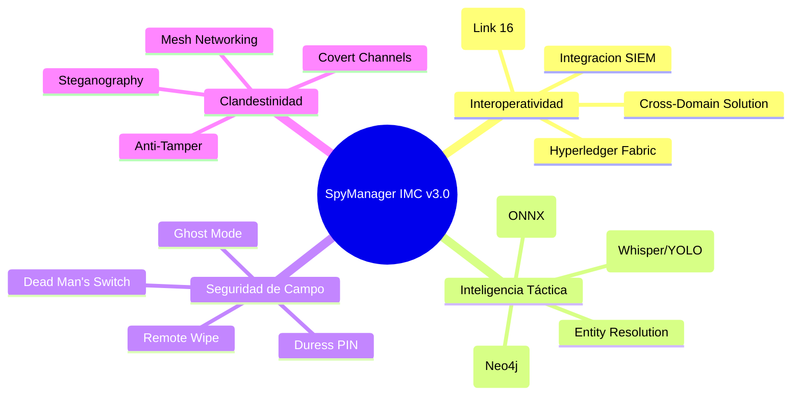
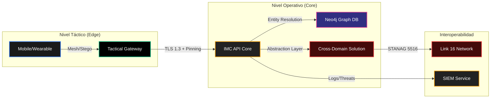
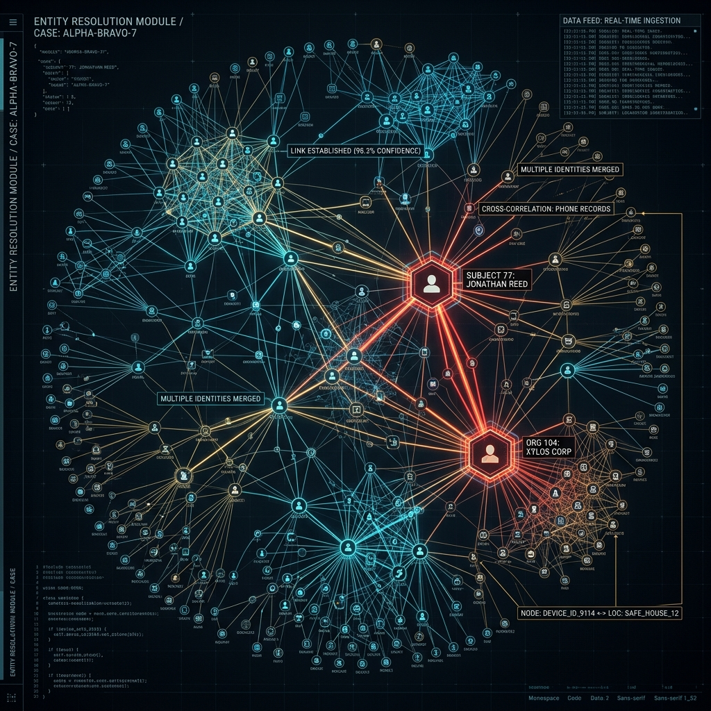

<div align="center">


# 🦅 Intelligence Management Core (IMC) - _SpyManager v3.0_

### Plataforma Soberana de Inteligencia & Ecosistema de Interoperabilidad Militar
**[PROYECTO ESTATAL-MILITAR CLASIFICADO]**

[](https://github.com/murdok1982)
[](https://github.com/murdok1982)
[](https://github.com/murdok1982)
[](https://github.com/murdok1982)

> **WARNING: ACCESO RESTRINGIDO - NIVEL DE CLASIFICACIÓN TOP SECRET**  
> _Cualquier intento de acceso no autorizado será neutralizado mediante protocolos de contra-inteligencia activa._

</div>

---

## 🛡️ REPORTE DE IMPLEMENTACIÓN - ACTUALIZACIÓN "VANGUARDIA"

El sistema **SpyManager (IMC)** ha sido elevado a estándares de grado militar-estatal, integrando capacidades avanzadas de interoperatividad, resiliencia y análisis táctico.


### 📊 Resumen de Capacidades Implementadas

#### [BACKEND & INFRAESTRUCTURA]
- 📡 **Interoperatividad Total:** Soporte nativo para **STANAG 5516 / Link 16** y **Cross-Domain Solutions (CDS)**.
- 🔐 **Resiliencia Extrema:** Implementación de **Disaster Recovery**, **Read-Replicas** y **Circuit Breakers** para operaciones críticas.
- 🕸️ **Protocolos Clandestinos:** Integración de **Steganography**, **Mesh Protocols** y **Covert Channels**.
- 🕵️ **Honeypot & Deception:** Casos de uso de Honeypot y **Digital Watermarking** para rastreo de fugas.
- 🛑 **Kill Switch:** Sistema de **Selective Remote Wipe** para dispositivos comprometidos.

#### [INTELIGENCIA & ANÁLISIS]
- 🧠 **IA Multimodal:** Procesamiento de inteligencia con **Whisper (Audio)** y **YOLO (Video/Imagen)**.
- 🔗 **Análisis de Vínculos:** Motor **Neo4j** para **Entity Resolution** y análisis de redes complejas.
- 📉 **Modelado de Amenazas:** Predicción de amenazas basada en **ONNX** para despliegue en el edge.

#### [FRONTEND & SEGURIDAD MÓVIL]
- 📱 **Endurecimiento de Dispositivos:** **Certificate Pinning**, **Anti-Tamper** y uso de **Secure Enclave**.
- 👻 **Ghost Mode:** Navegación y operación invisible en entornos hostiles.
- ⚠️ **Protocolos de Coacción:** **Duress PIN** y **Dead Man's Switch** integrados.

---

## 🧠 Mapa Mental del Ecosistema v3.0



---

## 🏗️ Arquitectura de Interoperabilidad y Flujo SIEM

El sistema ahora integra una capa de interoperatividad que permite la comunicación con sistemas OTAN y la exportación de logs a centros de comando (SIEM).



---

## 👁️ Visualización de Inteligencia (Análisis de Vínculos)

El motor Neo4j permite resolver identidades y detectar patrones de infiltración en tiempo real.



---

## 🔐 Seguridad Hardware & Enclave Seguro

Cada dispositivo móvil y wearable utiliza el Secure Enclave para la gestión de claves, garantizando que incluso ante compromiso físico, los secretos permanezcan inaccesibles.


---

## 🛠 Features Técnicas de Vanguardia

| Componente | Descripción | Nivel de Seguridad |
| :--- | :--- | :---: |
| 🛡️ **Chaos Engineering** | Pruebas de resiliencia ante fallos masivos de infraestructura. | `INQUEBRANTABLE` |
| 🕵️ **Behavioral Biometrics** | Identificación continua basada en patrones de uso del dispositivo. | `CRÍTICO` |
| 📡 **Link 16 Protocol** | Sincronización de datos tácticos bajo estándar STANAG 5516. | `MIL-SPEC` |
| 🧬 **Entity Resolution** | Correlación de identidades a través de múltiples fuentes de datos. | `ALTO` |

---

## 🚀 Guía de Operaciones (Despliegue Certificado)

### 1. Inicialización de Nodos Mesh
Para habilitar la red táctica sin dependencia de infraestructura civil:
```bash
python -m app.services.mesh_service --init-node --secure-enclave
```

### 2. Sincronización Link 16
Activa la exportación de datos bajo estándar STANAG:
```bash
export STANAG_MODE=ENABLED
uvicorn app.main:app --host 0.0.0.0 --port 8000 --ssl-cert certs/military.crt
```

---

<div align="center">

**[ 💻 Sistema Auditado y Asegurado por @murdok1982 ](https://github.com/murdok1982)**

_Nihil est opertum quod non reveletur, et occultum quod non sciatur._<br><br>
`EOF:` *<tactical_deployment_complete>*

</div>
