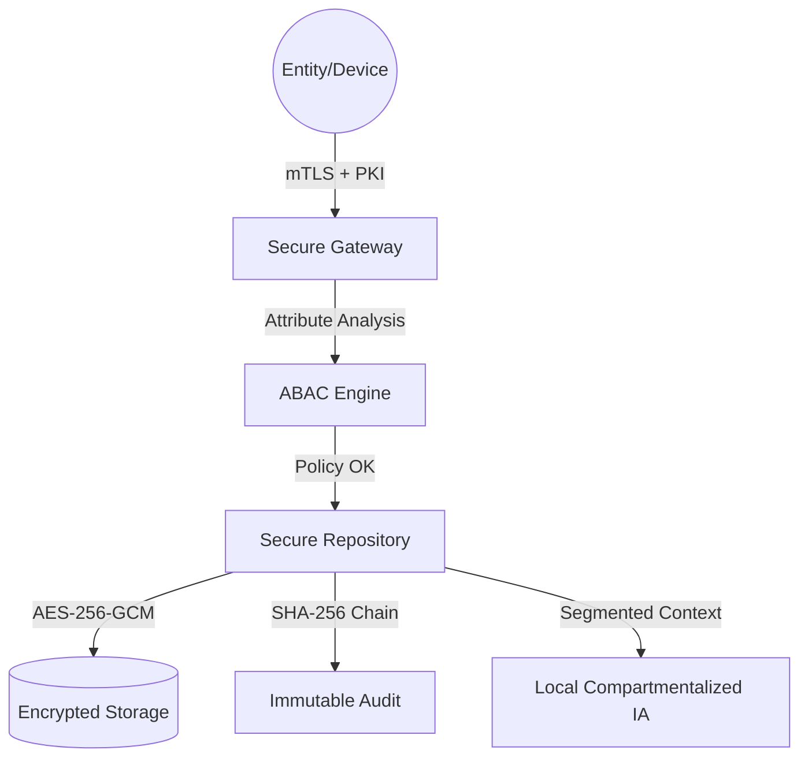

# 🦅 Intelligence Management Core (IMC)

> **WARNING: CLASSIFIED & PRIVATE SYSTEM**
> **Creator:** [USUARIO] (@murdok1982)
> 
> **RESTRICTIVE LICENSE:** This software is the exclusive intellectual property of its creator. Unauthorized use, access, duplication, or distribution is strictly prohibited. Permission for ANY use must be granted expressly and in writing by the creator. Unlicensed usage is subject to legal action under international intellectual property and cyber-intelligence protocols.

IMC is a **Sovereign Intelligence Platform** designed for total management of strategic information, human sources, and field coordination. Built on **Zero Trust** principles and **Self-Sovereign Architecture**.

---

## 🔐 Security Architecture



### Core Security Pillars
*   **Zero Trust Enforcement**: Every request is verified via mTLS and subject to dynamic Attribute-Based Access Control (ABAC).
*   **Need to Know (N2K)**: Total compartmentalization by case. Information from Case A is mathematically invisible to Case B.
*   **Immutable Ledger**: Append-only auditing with cryptographic hash-chaining to prevent log tampering.
*   **Local Sovereignty**: All AI processing (embeddings, vector search) happens locally per compartment. No data leaks to external cloud APIs.

---

## 🛠 Features implemented

### 1. IAM & ABAC
- **PKI Manager**: Internal CA for generating entity certificates (Ed25519).
- **ABAC Engine**: Dynamic policy evaluation based on roles, classification levels (UNCLASSIFIED to TOP SECRET), and case assignment.

### 2. Intel Ingestion
- **AES-256-GCM Encryption**: Authenticated encryption for all intelligence payloads.
- **Secure Repository**: Wraps database operations with ABAC enforcement and automatic auditing.

### 3. Compartmentalized AI
- **Case Isolation**: Vector embeddings are generated and stored per-case.
- **Relationship Discovery**: Local correlation analysis without breaking compartment boundaries.

---

## 🚀 Deployment (Operational Mode)

1. **Initialize PKI foundation**:
   ```bash
   python -c "from app.core.pki_manager import PKIManager; PKIManager().generate_ca()"
   ```

2. **Run Secure Backend**:
   ```bash
   uvicorn app.main:app --host 0.0.0.0 --port 8000 --ssl-keyfile certs/server.key --ssl-certfile certs/server.crt
   ```

---

## ⚖️ Prohibitions & Responsibility
This software is intended for use by specialized agencies. The implementation of "Double-Blind" sources and "Clandestine Operations" logic must only be activated under proper legal supervision. Antigravity assumes no responsibility for misuse of offensive capabilities.

---
**IMC Project - Vanguard Security Ecosystem**
