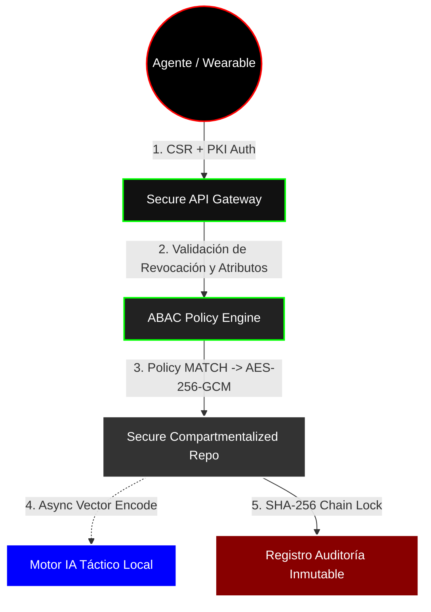

<div align="center">

# 🦅 Intelligence Management Core (IMC) - _SpyManager_
### Sovereign Intelligence Platform & Zero Trust Ecosystem

> **WARNING: CLASSIFIED & PRIVATE SYSTEM**<br>
> **Creator:** [@murdok1982] (Única Entidad Autorizada)<br>
> **Status:** `OPERATIONAL` | **Security Level:** `VANGUARD (POST-AUDIT)`

</div>

---

**RESTRICTIVE LICENSE:** This software is the exclusive intellectual property of its creator. Unauthorized use, access, duplication, or distribution is strictly prohibited. Permission for ANY use must be granted expressly and in writing by the creator. Unlicensed usage is subject to legal action under international intellectual property and cyber-intelligence protocols.

---

## ⚡ What is IMC?

IMC es una Plataforma de Gestión de Inteligencia Soberana diseñada para la recolección, compartimentación y análisis de información estratégica en tiempo real. Construido desde sus cimientos bajo el paradigma de **Seguridad Zero Trust** y dotado de capacidades de **Inteligencia Artificial Local**.

### 🌟 Arquitectura Post-Auditoría (v2.0)
Tras la última profunda auditoría de ciberseguridad liderada por arquitectos militares, el sistema ha sido ascendido a _Grado Enterprise-Táctico_:

- 🔐 **PKI Descentralizada Real:** El servidor central ya no genera las claves privadas. Los agentes y wearables envían un **CSR**; el núcleo solo firma. *Zero-Knowledge* absoluto sobre la identidad criptográfica del operativo.
- ⛓️ **Auditoría Blokchain Consistente:** Resolución resolutiva a vulnerabilidades de _Race Condition_. La cadena SHA-256 es 100% determinística (RFC 8785) mediante control asincrónico por concurrencia y validación estricta en el serializador.
- 🧠 **Motor I/A Asíncrono Hibridado:** La indexación vectorial para el descubrimiento de compartimentos y Need-To-Know N2K ahora ocurre en hilos (async context pool) sin sacrificar milisegundos de latencia I/O en la unidad principal. 

---

## 🔒 Pilar de Seguridad: El Flujo Zero Trust



## 🛠 Features Clandestinas Implementadas

1. **Gestión de Identidades (Wearables y Análisis):** Certificados limitados a roles y expiraciones tácticas.
2. **Compartimentación Need-to-Know (N2K):** Cifrado en tránsito, en repuso y aislamiento por Caso.
3. **Repetidor Clandestino / Kill Switch:** Paquetes camuflados bajo lecturas de clima (`"WEATHER_SYNC"`) y desconexión fulminante de identidades comprometidas en segundos.

---

## 🚀 Despliegue Operacional

1. **Inicialización de PKI CA Soberana**:
   ```bash
   python -c "from app.core.pki_manager import PKIManager; PKIManager().generate_ca()"
   ```

2. **Arranque Securizado:**
   _(Requiere provisión de una MASTER_KEY mediante variable de entorno o inyectará una efímera para forzar Fail-Safe)_
   ```bash
   export IMC_MASTER_KEY="[32_BYTES_HEX_SECURE_TOKEN]"
   uvicorn app.main:app --host 0.0.0.0 --port 8000 --ssl-keyfile certs/server.key --ssl-certfile certs/server.crt
   ```

---

<p align="center">
  <b>Creado por <a href="https://github.com/murdok1982">@murdok1982</a></b><br>
  <i>In Code We Trust, In Tech We Survive.</i>
</p>
