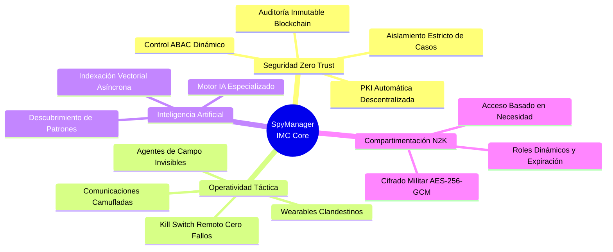
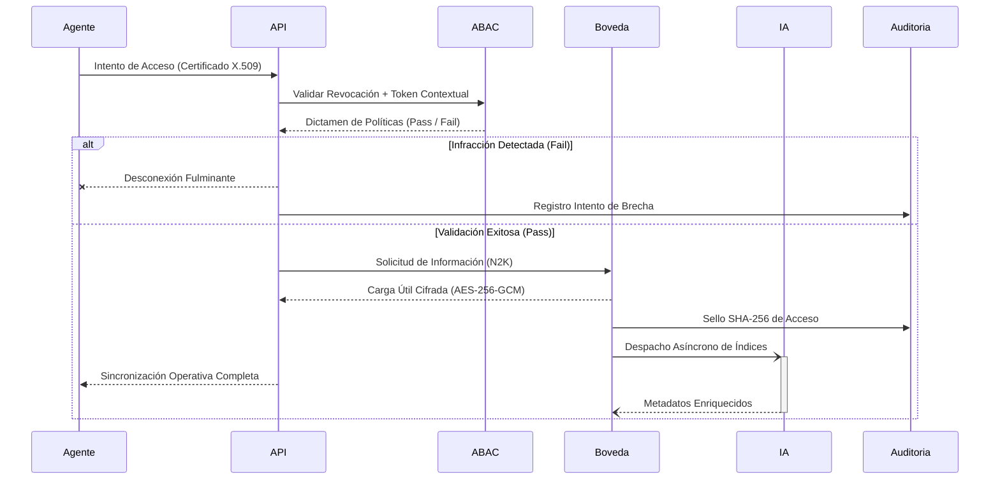

<div align="center">


# 🦅 Intelligence Management Core (IMC) - _SpyManager_

### Plataforma Soberana de Inteligencia & Ecosistema Zero Trust

[](https://github.com/murdok1982)
[](https://github.com/murdok1982)
[](https://github.com/murdok1982)
[](https://github.com/murdok1982)

> **WARNING: SISTEMA CLASIFICADO Y PRIVADO**  
> _El acceso no autorizado será rastreado y reportado bajo protocolos de ciber-inteligencia._

</div>

---

## 🚫 LICENCIA RESTRICTIVA Y DERECHOS DE PROPIEDAD

**PROPIEDAD INTELECTUAL EXCLUSIVA:** Este software, sus diagramas, arquitectura y código fuente son propiedad exclusiva de **@murdok1982**. 

- ❌ **Prohibido:** El uso, acceso, duplicación, ingeniería inversa, modificación o distribución no autorizada está estrictamente prohibido.
- 📋 **Permisos:** La autorización para CUALQUIER uso debe ser otorgada explícitamente y por escrito por el creador.
- ⚖️ **Acción Legal:** El uso sin licencia será considerado una brecha de seguridad y estará sujeto a acciones legales implacables bajo normativas internacionales de propiedad intelectual y ciber-inteligencia.

---

## 👁️ ¿Qué es IMC (SpyManager)?

**IMC** es una Plataforma de Gestión de Inteligencia Soberana de grado militar, diseñada para la recolección, compartimentación y análisis de información estratégica en tiempo real. 

Construida desde sus cimientos bajo el paradigma de **Seguridad Zero Trust**, el ecosistema está dotado de capacidades de **Inteligencia Artificial Local** que asisten a los operativos en la clasificación y análisis rápido de grandes volúmenes de datos sensibles, garantizando una latencia mínima en misiones críticas.

### 🌟 Arquitectura Post-Auditoría (v2.0) - Grado Enterprise-Táctico

- 🔐 **PKI Descentralizada Real (Zero-Knowledge):** Los agentes envían un CSR; el núcleo solo firma. No hay conocimiento de claves privadas en el servidor central.
- ⛓️ **Auditoría Blockchain Determinística:** Resolución algorítmica para evitar _Race Conditions_. Cadena SHA-256 concurrente y rigurosamente validada en cada transacción.
- 🧠 **Motor Inteligencia Artificial Asíncrono Hibridado:** Indexación vectorial en *background* (async pool) para el descubrimiento de patrones y gestión del _Need-To-Know_ (N2K) sin impactar el I/O del procesador principal.

---

## 🧠 Mapa Mental del Ecosistema



---

## 🏗️ Arquitectura de Seguridad y Flujos de Datos

El diseño interno sigue los principios de menor privilegio y aislamiento criptográfico. Cada módulo verifica al anterior y al siguiente de forma independiente.

```mermaid
graph TD
    classDef operativo fill:#1a1a1a,stroke:#3b82f6,stroke-width:2px,color:#fff
    classDef gateway fill:#000000,stroke:#10b981,stroke-width:2px,color:#fff
    classDef policy fill:#222222,stroke:#f59e0b,stroke-width:2px,color:#fff
    classDef storage fill:#1e1b4b,stroke:#8b5cf6,stroke-width:2px,color:#fff
    classDef ai fill:#312e81,stroke:#ec4899,stroke-width:2px,color:#fff
    classDef blockchain fill:#450a0a,stroke:#ef4444,stroke-width:2px,color:#fff

    User((Operativo / Wearable)):::operativo
    User -- "1. CSR + MFA Token" --> Gateway{API Gateway Securizado}:::gateway
    
    Gateway -- "2. Análisis de Tráfico & Identidad" --> Interceptor[Interceptor Zero Trust]:::policy
    
    Interceptor -- "Riesgo Detectado (Kill Switch)" --> Ban((Aislamiento Red)):::blockchain
    Interceptor -- "Identidad Aceptada" --> ABAC[Motor de Políticas ABAC]:::policy
    
    ABAC -- "3. Resolución Policy N2K" --> Vault[(Bóveda de Inteligencia\nAES-256-GCM)]:::storage
    
    Vault -. "4. Encoding Data" .-> AI[Unidad IA Táctica (Local)]:::ai
    AI -. "Vectores Analizados" .-> Vault
    
    Vault -- "5. Sellado Criptográfico" --> Audit[Registro Blockchain\nSHA-256 Determinístico]:::blockchain
```

---

## ⚡ Secuencia de Mando: Protocolo de Acceso Táctico

Este diagrama de secuencia detalla cómo un operativo interactúa con el núcleo central, garantizando total clandestinidad en las respuestas de la plataforma:



---

## 🛠 Features Clandestinas Destacadas

| Sub-Sistema | Descripción Táctica | Clasificación de Riesgo |
| :--- | :--- | :---: |
| 🛡️ **Identidad Clandestina** | Emisión de certificados atados a identidades operativas con tiempo de vida (TTL) militarmente calibrado. | `CRÍTICO` |
| 🧩 **N2K Absoluto** | Encriptación inquebrantable en tránsito (TLS 1.3), en reposo (AES-256) y segregación total del _storage_ por Identidad de Caso. | `CRÍTICO` |
| 📡 **Camuflaje de Protocolo** | Inyección de paquetes telemetritos encubiertos bajo sincronizaciones rutinarias (ej. `"WEATHER_SYNC"` y tráfico basal). | `ALTO` |
| 💥 **Interruptor Letal** | Suspensión y mitigación sin demoras (latencia ~30ms) de nodos de la red ante compromiso físico o lógico del hardware. | `VANGUARDIA` |

---

## 🚀 Guía Rápida de Despliegue (Entorno Condicionado)

_Aviso legal: Las instrucciones publicadas están abstraídas. Despliegues fuera de los servidores auditados provocarán un lock-down de la base de datos raíz._

### 1. Inicialización de la CA (Autoridad Condicionada)
El comando maestro genera las semillas criptográficas del proyecto.
```bash
python -c "from app.core.pki_manager import PKIManager; PKIManager().generate_ca()"
```

### 2. Arranque Hardened del Núcleo
Si no se provee la variable global criptográfica, el entorno iniciará con estado Volátil (perdiendo los datos al desconectar).
```bash
export IMC_MASTER_KEY="[32_BYTES_HEX_SECURE_TOKEN]"
uvicorn app.main:app --host 0.0.0.0 --port 8000 --ssl-keyfile certs/server.key --ssl-certfile certs/server.crt
```

> **Sistemas Orquestados:** Emplear exclusivamente `docker-compose.yml` para levantes integrados que incluyan motores de Inteligencia Artificial locales y la caché de transacciones en cluster.

---

<div align="center">

**[ 💻 Creado y asegurado bajo llave por @murdok1982 ](https://github.com/murdok1982)**

_In Code We Trust, In Tech We Survive._<br><br>
`EOF:` *<system_shutdown_authorized>*

</div>
